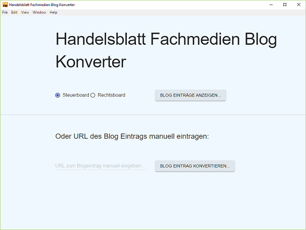

# hbfm-blogreader-tool




## To Use

To clone and run this repository you'll need [Git](https://git-scm.com) and [Node.js](https://nodejs.org/en/download/) (which comes with [npm](http://npmjs.com)) installed on your computer. From your command line:

```bash
# Clone this repository
git clone https://github.com/HB-Fachmedien/hbfm-blogreader-tool
# Go into the repository
cd hbfm-blogreader-tool
# Install dependencies and run the app
npm install && npm start
# Package app (Windows x64)
npm run-script package
```

**Blog konvertieren:**
- Auf den entsprechenden Listeneintrag klicken oder direkt die URL eingeben und mit dem Button die Konvertierung anstoßen.
- XML Dateien werden dann in den **./output** Ordner gelegt.

**Build with Electron**
Learn more about Electron and its API in the [documentation](http://electron.atom.io/docs/latest).

